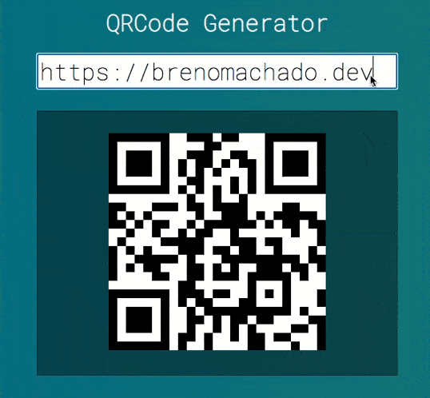

# Vue QRCode Generator
A QRCode Generator made with Vue

## Screenshots


## Dependencies
- VueJS
- Http Server
- QRious

## Dev dependencies
To run on dev environment run:

```sh
npm install
npm start
```
> The QRCode Generator will run on  http://localhost:8080


## See more
For more information about me or other projects: [brenomachado.dev](https://brenomachado.dev)